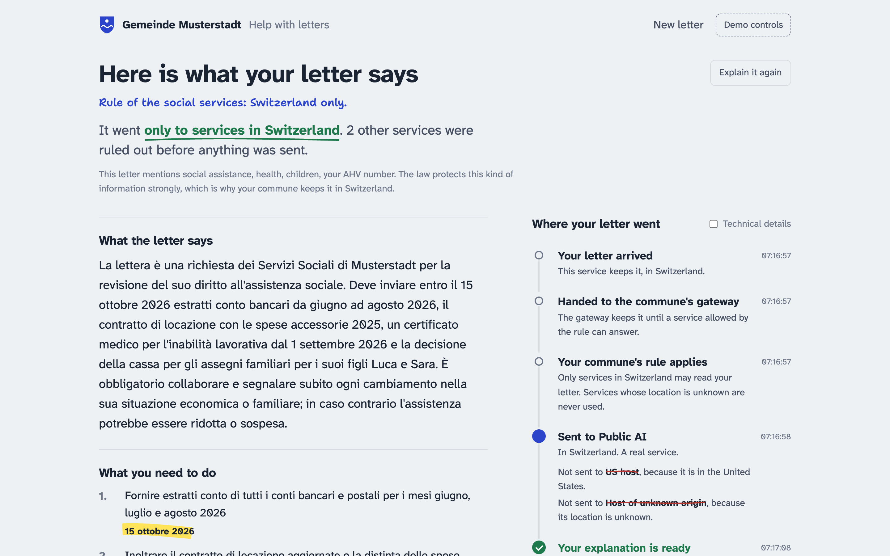
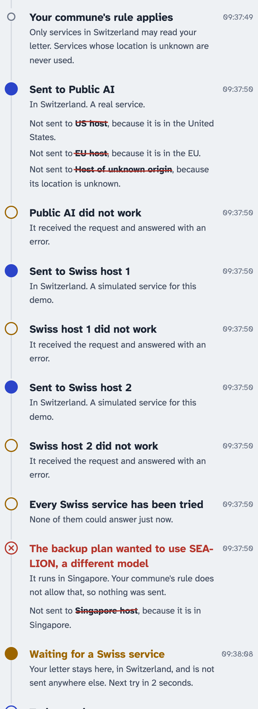
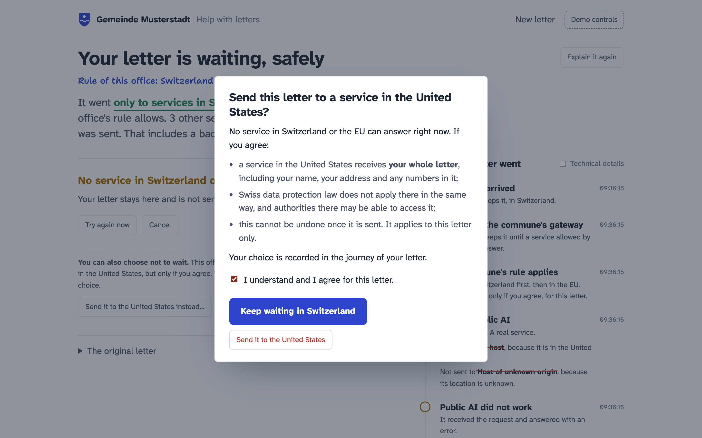
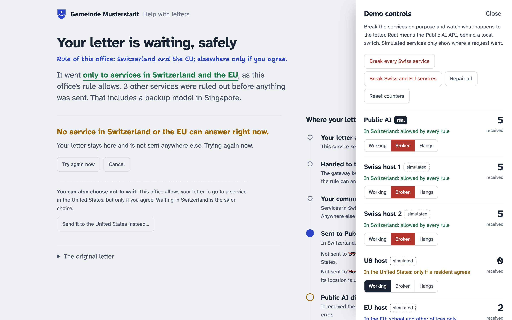
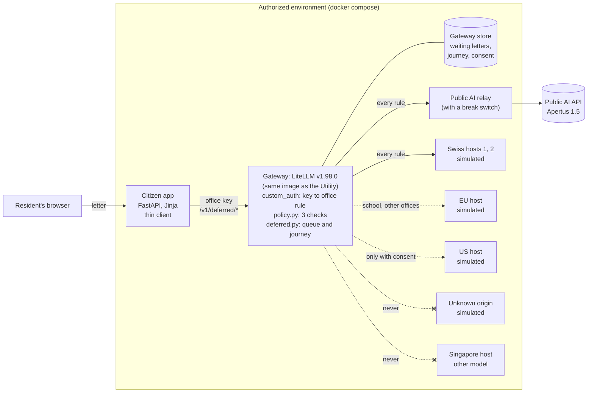

# Commune letter helper

**A public AI service that keeps its promise about citizens' data, even when providers fail.**

It explains an official letter in simple words, in German, French, Italian, Romansh, Swiss German or English, with Apertus through the Public AI API. It sends the letter only where the commune's rule allows, on every retry and every fallback. When no allowed service is up, the letter waits in Switzerland until one is back. Built in 24 hours at the Swiss {ai} Weeks (Zurich, September 2026) for the Public AI challenge "Build a public AI service". Apache 2.0.



## Try it online (during the Swiss {ai} Weeks)

**https://343bd0c9.sslip.io**, user `jury`. The password is in our submission, and the team can give it to you.

- **Location.** This shared demo runs on AWS in Frankfurt (EU). In a real deployment the gateway runs in the commune's own environment in Switzerland.
- **Shared state.** If services are broken when you arrive, another visitor broke them. *Demo controls → Repair all and reset counters* fixes that.
- **Timing.** The "Public AI" service is the real Public AI API, and a real answer takes 10 to 60 seconds. If Public AI times out (we have seen 504s after 60 seconds under load), the gateway moves on to a Swiss service within the rule. That answer is simulated and labelled as such, and the journey shows what happened.

**To see the consent dialog:**
1. Choose the example *"Second payment reminder"*. It sets *The letter is from: Another office*, the only office whose rule allows consent.
2. Open *Demo controls* and press *Break Swiss and EU services*.
3. Press *Explain my letter*. After about 20 seconds the page says *Your letter is waiting, safely* and offers *Send it to the United States instead…*.
4. Open it, tick *I understand*, and press *Send it to the United States*. The journey records your agreement, and the US host's counter in *Demo controls* goes to 1.

For the social services and the school the offer never appears: their rules do not allow consent.

## The short version

**The problem is in production today.** The Public AI Utility routes requests through LiteLLM with automatic fallbacks. In its own configuration, when the Swiss host for Apertus fails, requests fall back to *other models hosted in other countries* (SEA-LION in Singapore, Bielik in Poland). We ran that configuration offline, in the image production runs. With the Swiss host down, a normal request was answered by the Singapore mock.

**What we built:**
- a civic service, *"Understand a letter from your commune"*;
- a gateway that enforces the commune's rule on every attempt, including LiteLLM retries and cross-model fallbacks;
- a queue inside that gateway: if no allowed service can answer, the letter waits there, in Switzerland, and completes by itself later, even across a gateway restart. No application has to implement waiting.

**Three offices, three rules.** Each rule is bound to the office's API key, never to the request:

| Person | Letter from | Rule |
|---|---|---|
| Ana, the strict compliance case | social services (support, health, children) | **Switzerland only.** No exceptions, not even with consent. |
| A family, privacy first | the school | **Switzerland first, then the EU.** Never anywhere else. |
| Marco, pragmatic | another office (payment reminder) | **Switzerland and the EU. The United States only if he explicitly agrees**, for that one letter, recorded. |

**What we can show.** Every endpoint counts what it receives. **48 automated checks** assert that endpoints a rule excludes receive **zero** requests, and that overrides through parameters, tags or headers are ignored. Two more checks restart the gateway and recreate the endpoints.

**Ready for upstream.** [`upstream/`](upstream/README.md) is a patch for chat.publicai.co: jurisdiction metadata, the same policy as an opt-in per key or team, and attribution headers. It is tested on the Utility's own rendered production config: **10/10 checks**.

**What we cannot show.** Where a provider physically computes. That needs provider-side evidence. We show where *our gateway* sent the data, and we say so.

## See it

| The letter waits; the backup model in Singapore is ruled out | Marco decides; his choice is recorded | The demo controls: excluded services stay at 0 |
|---|---|---|
|  |  |  |

## Try it (5 minutes)

You need Docker with Compose. A Public AI key is optional.

```bash
git clone -b public-ai-service https://github.com/SRGSSR/srgssr-zh-hackathon-2026.git
cd srgssr-zh-hackathon-2026
cp env.example .env          # optional: add PUBLICAI_API_KEY for real Apertus answers
docker compose up -d --build # first start pulls the LiteLLM image (about 1 GB)
open http://localhost:8080
```

Without a key, the "real" endpoint answers with a clearly labelled **simulated** response, and everything else works the same.

**Demo script.** Open *Demo controls* at the top right to break and repair services.

1. **Ana.** Pick the example *"Documents needed for your support"*, choose *Italiano*, then *Explain my letter*. You get the explanation, the deadlines and a German draft reply. The journey on the right shows the rule, the places ruled out before anything was sent (struck through), and who answered.
2. **Break every Swiss service**, then *Explain it again*. The letter waits. The journey shows LiteLLM's backup plan (SEA-LION in Singapore) ruled out, and nothing sent. There is no consent option for Ana.
3. **The family.** New letter, the example *"Class camp"*. The EU host answers because the school's rule allows it. The US and Singapore counters stay at 0.
4. **Marco.** *Break Swiss and EU services*, new letter, the example *"Second payment reminder"*. While it waits, he can choose *Send it to the United States instead…*. The dialog says exactly what that means. He agrees, the US counter goes to 1, and his agreement appears in the journey.
5. **Repair all.** Ana's waiting letter completes by itself.

The real Public AI API can be slow under load. If it does not answer, the gateway moves on to a Swiss service within the rule, and the journey shows it.

## How it works



**The rule is checked three times, in one LiteLLM callback** ([`gateway/policy.py`](gateway/policy.py)):

| When | Check |
|---|---|
| once per request | Rejects anything that tries to steer routing: client `fallbacks`, `tags` (body, metadata, header), `api_base`, a deployment id as `model`, spoofed metadata, and keys without a rule. |
| before **every** attempt (first try, retries, fallbacks) | Keeps only deployments whose jurisdiction the rule allows, in the rule's order of preference. Deployments with missing metadata are excluded (fail closed). |
| right before each send | Re-checks the deployment and the exact URL about to be used. |

**The queue lives in the gateway** ([`gateway/deferred.py`](gateway/deferred.py)). It is loaded as a LiteLLM callback, adds `/v1/deferred/*` endpoints and runs a worker, and every attempt still passes the three checks.
- A job is visible only to the key that submitted it.
- The letter's text is deleted as soon as the job ends.
- A waiting job survives a gateway restart.

**Consent is not a request parameter.** Only a rule that lists `consent_can_add` accepts it. The resident gives it in a dialog, the gateway records it, and it widens the rule for that one letter only; Swiss and EU services are still tried first. The social services' rule refuses consent.

**Why not LiteLLM's tag routing?** We tested it in the Utility's version. Retries and fallbacks widen the tag set, and several request fields bypass it ([docs/findings.md](docs/findings.md)).

## Proof: the test bench

```bash
make test   # starts the stack, runs 48 pytest checks, then restarts the gateway and recreates the endpoints
```

The assertions use each endpoint's own counter of received requests. That is the ground truth, independent of the gateway's logs.

| Scenario | What is asserted |
|---|---|
| Normal run | the preferred allowed service answers; nobody else received anything |
| Primary down | the next allowed service answers; excluded services were blocked on every attempt and received 0 |
| All allowed services down | the letter waits; excluded services received 0 |
| LiteLLM fallback to another model (SEA-LION) | evaluated, blocked before send, 0 received |
| Deployment without jurisdiction metadata | excluded (fail closed), 0 received, even when it is the only one up |
| Override attempts (17 variants: params, tags, headers, key without rule) | all rejected; excluded services received 0 |
| Timeout after the provider received the data | the journey says "received your letter but never answered" |
| Recovery | the waiting letter completes by itself, or on "try again" |
| Queue in the gateway | waits without any app, body deleted afterwards, invisible to other keys, cancelled letters never sent, no event injection into another letter's journey |
| Three rules and consent (11 checks) | the school uses the EU only when Switzerland is down and never goes further; consent is refused where the rule does not allow it, through another key, or for other places; it sends only that letter; Switzerland is still tried first; the sync API never reaches the US |
| Gateway restart and endpoint recreate | the waiting letter survives the restart; after new endpoint containers, requests reach exactly the named endpoint |

The same policy is tested on the Utility's own production config: `upstream/test/render.sh` and `upstream/test/run.sh` give 10/10.

The bench and the demo share the same endpoints, so do not click the demo controls while `make test` runs.

## What we found along the way

Useful beyond this project; details and evidence in [docs/findings.md](docs/findings.md):

- **The Utility's fallbacks cross borders and model families.** Every Apertus model group falls back to SEA-LION (Singapore) and Bielik (Poland).
- **Its config cannot carry jurisdiction metadata today.** The Helm template renders only the two cost fields of `model_info` and silently drops everything else, including `id`.
- **Production runs LiteLLM v1.98.0, not the v1.92.0 pinned in the chart.**
- **TLS verification is off** (`ssl_verify: false`). A policy decides on provider names, and only certificate verification binds a name to the real server. We saw what happens without it in our own demo: a stale DNS cache (LiteLLM keeps DNS answers for 300 s) sent one letter to a different container than the one every log named. Only the endpoints' counters caught it. Fixed, and now tested.
- **LiteLLM's tag routing widens tags on retries**, and the failure callback fires once per request, not once per attempt.
- **15 cost values are loaded as strings** (`1e-07` without a decimal point).
- A request-level `api_base` injection we reproduced on v1.92.0 is rejected on v1.98.0, the version in production.

## Honest claims

- **We can show** which services our gateway contacted, which it excluded before sending anything, and which rule it applied, for every attempt. The tests prove it with the endpoints' own counters.
- **We cannot prove** where processing physically happens. "Jurisdiction" is declared metadata. Physical location needs provider-side evidence (contracts, audits, attestation).
- **The real endpoint routes internally.** The Public AI API sends requests to its own inference partners, which we cannot observe. In this prototype the fictional commune "approves" it as Swiss (`jurisdiction_basis` in the config says so).
- **Waiting letters are stored in the gateway**, a volume in the same environment. The gateway and its logs are part of the data path. Our events carry routing data only, never letter text.
- **Consent is not legal advice.** Whether a resident's consent is enough for a public body to send data outside Switzerland or the EU depends on the office and the canton. That is why the social services' rule refuses it. Check with a data protection officer before offering it for real.
- **Simulated services are simulated.** Their answers are labelled and only show where a request went.

## Limitations and threat model

**In scope:** citizen data must not reach a service outside the office's rule because of a request, a retry, a fallback, a misconfigured deployment or missing metadata.

**Out of scope:** a compromised gateway host, a malicious operator editing the configuration, provider-side behavior, network egress controls. In production, TLS verification and an egress allowlist must back the policy.

**Prototype limits:**
- There are no user accounts, and all ports bind to `127.0.0.1`.
- There is one civic task, and chat completions only.
- The queue relies on adding routes to LiteLLM's FastAPI app from a callback. That is not an official extension API.
- The queue runs as one replica with SQLite, and its calls skip the proxy's spend tracking.
- The explanation comes from a language model: it can be wrong, it is not legal advice, and the resident checks the draft.
- All letters and data are fictional (Gemeinde Musterstadt, AHV 756.0000.0000.00). Do not paste real letters.

The open questions are listed in [docs/findings.md](docs/findings.md#12-open-questions-to-verify).

## Repository map

```
gateway/     LiteLLM config, policy.py (the 3 checks), deferred.py + store.py (queue, journey, consent),
             custom_auth.py, communes.yaml (one key and rule per office)
endpoints/   faultbox.py: OpenAI-compatible mock and relay with working, broken and hanging modes and counters
app/         the citizen app: a thin client of the gateway, JSON validation, the journey view
samples/     four fictional letters (social services x2, school, finance office)
tests/       the test bench, plus restart_check.sh
upstream/    the proposal for chat.publicai.co, tested on its production config
docs/        findings.md (how LiteLLM really behaves, open questions), pitch.md, plan-example-app.md
```

Apache 2.0, see [LICENSE](LICENSE). Fonts: Atkinson Hyperlegible Next and Shantell Sans (SIL Open Font License). Hand-drawn marks: [rough-notation](https://github.com/rough-stuff/rough-notation) (MIT).
