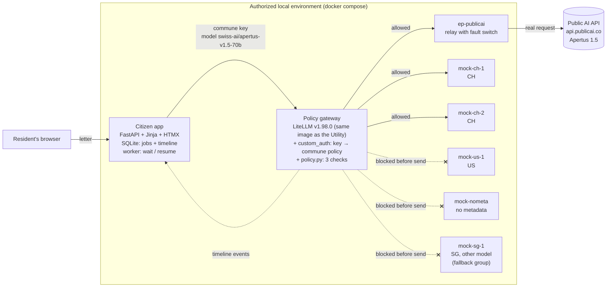

# Commune letter helper: a public AI service that keeps its promise when providers fail

> **When the approved provider fails, does a public AI service still keep its promise about citizens' data?**
>
> Our prototype completes a real civic task with Apertus through Public AI. It enforces a commune's routing rule across every retry and fallback, and it resumes interrupted work once an approved endpoint is back. In the demo, the jury breaks providers on purpose. A request timeline and reproducible tests show exactly which endpoints were contacted and whether the rule held.

Built at the Swiss {ai} Weeks hackathon (Zurich, September 2026) for the Public AI challenge "Build a public AI service". Apache 2.0.

## The problem

The Public AI Utility (chat.publicai.co) routes requests through LiteLLM to several providers, with automatic fallbacks. In its current config, `swiss-ai/apertus-v1.5-70b` is served by Infomaniak (CH) and Featherless (country not stated). When those fail, it falls back to **other model families hosted elsewhere**: SEA-LION (api.sea-lion.ai) and Bielik (llmlab.plgrid.pl).

We ran that exact config offline, in the image production runs, with the Swiss host down. The request was answered by the SEA-LION mock (see `upstream/`).

A Swiss commune that wants to use such a service cannot promise its residents that their data only goes to approved endpoints, least of all when something breaks.

## What we built

- **The civic task: "Understand a letter from your commune".** A resident pastes an official letter written in bureaucratic German (tax assessment, payment reminder, naturalisation paperwork). They get:
  - a plain-language explanation in their language (Italian, French, Portuguese, Albanian, English, ...);
  - the actions they must take, with deadlines;
  - a draft reply in German.

  Apertus must return JSON (`summary`, `actions[{action, deadline}]`, `draft_reply`, `output_language`). The JSON is validated and the call is retried once if invalid. A disclaimer says this is not legal advice and the draft must be checked.
- **The commune's rule, "CH-only", bound to its API key.** Only endpoints whose declared jurisdiction is CH may receive the letter. The rule is checked before **every** attempt, including retries and LiteLLM fallbacks to other model groups. Endpoints with missing metadata are excluded (fail closed). Nothing in a request can change the rule.
- **Continue within the rule, or wait.** If an approved endpoint is up, the job continues there. If none is, the job stays in the service's local database ("waiting"), the resident sees why, and it resumes by itself when an approved endpoint is back.
- **A timeline per job**, showing:
  - the rule applied;
  - every routing decision: endpoints selected, and endpoints **blocked before any data was sent**, with the reason;
  - every send, and its outcome: answer, error, or "data received, no response" (timeout after the provider got the data);
  - the model that answered.
- **A demo control panel** to break, hang or restore each endpoint, plus "Break all approved". Real and simulated endpoints are labelled.

## Architecture



The policy (`gateway/policy.py`) is one LiteLLM `CustomLogger` with three checks:

| where | when | what it does |
|---|---|---|
| `async_pre_call_hook` | once per request | Rejects request fields that steer routing: client `fallbacks`, `tags` (body, metadata, `litellm_metadata`, header), `api_base` / `base_url` / `api_key`, a deployment id or other model group as `model`, `mock_response`, spoofed `routing_policy`. Rejects keys without a policy. |
| `async_filter_deployments` | before **every** attempt (first try, retries, fallbacks) | Keeps only deployments with complete metadata whose jurisdiction is allowed. Picks the highest-priority one that has not failed yet in this request. Logs every exclusion. |
| `async_pre_call_deployment_hook` | right before each send | Re-checks the chosen deployment and that the `api_base` about to be used is the configured one. |

Why not LiteLLM's tag-based routing? We tested it in the image the Utility runs. Retries and fallbacks widen the tag set, and several request fields bypass it. See [docs/findings.md](docs/findings.md).

## Run the demo

```bash
cp env.example .env        # optional: set PUBLICAI_API_KEY for real Apertus answers
docker compose up -d --build
open http://localhost:8080
```

Without `PUBLICAI_API_KEY`, the "real" endpoint's relay answers with a clearly labelled **SIMULATED** response. Everything else works the same.

**Demo script** (about 3 minutes):
1. Pick a sample letter and a language, then "Explain this letter". The timeline shows the rule applied, the endpoints excluded before any send (US, missing metadata), the send to Public AI, and the answer.
2. In the side panel, **Break** `publicai-apertus` and submit again. The job switches to `mock-ch-1`. US, no-metadata and SG still show **0 received**.
3. **Break all approved** and submit. The job waits. The resident sees that their letter is kept locally. The timeline shows the fallback to the SEA-LION group, blocked before send.
4. **Restore** any CH endpoint. The job resumes and completes, and the timeline shows the whole outage.
5. Optional: **Hang** `mock-ch-1`. The timeline marks "data received, no response" for that endpoint, then continues on `mock-ch-2`.

## Run the tests

```bash
make test        # = docker compose up -d --build && docker compose --profile test run --rm tests
```

24 pytest checks cover the 8 scenarios. The assertions rely on each endpoint's own counter of received requests:

| # | scenario | asserted |
|---|---|---|
| 1 | normal | the approved primary answers; every other endpoint received 0 |
| 2 | primary down | the second approved endpoint answers; disallowed endpoints were blocked on every attempt and received 0 |
| 3 | all approved down | the job is `waiting`, and US / no-metadata / SG received **0** |
| 4 | LiteLLM fallback to another model group | the SEA-LION group was evaluated and blocked before send; SG received 0 |
| 5 | missing jurisdiction metadata | excluded with "missing metadata (fail closed)"; received 0, even when it is the only endpoint up |
| 6 | override via params, tags, headers, key without policy | 16 variants, each rejected; disallowed endpoints received 0 |
| 7 | timeout after receipt | the endpoint counted the request; the timeline says "data received, no response" |
| 8 | recovery | the waiting job completes when an approved endpoint returns, both on "try again" and by itself with backoff |

The same policy is tested against the Utility's own rendered production config in `upstream/test/` (10/10 checks).

## Repository layout

```
gateway/     LiteLLM config, policy.py (the 3 checks + timeline events), custom_auth.py, communes.yaml
endpoints/   faultbox.py: OpenAI-compatible mock / relay with up|down|slow|timeout and request counters
app/         citizen app (FastAPI, Jinja, HTMX, SQLite), worker, timeline
samples/     3 fictional letters (Gemeinde Musterstadt, AHV 756.0000.0000.00)
tests/       the test bench
upstream/    PR-ready proposal for chat.publicai.co, tested against their rendered config
docs/        findings.md (Phase 0: how LiteLLM really behaves in the Utility's version)
```

## Honest claims

- **We can show** which endpoints *our gateway* contacted, which it excluded before sending anything, and which rule it applied, for every attempt. The tests prove it with the endpoints' own request counters.
- **We cannot prove** where processing physically happens. "Jurisdiction" is metadata declared in the config. Proving physical location needs provider-side evidence (contracts, audits, hardware attestation), which is out of scope.
- **The real endpoint routes internally.** The Public AI API sends requests to its own inference partners, and we cannot observe or control that from outside. In this prototype the fictional commune "approves" it as CH; the UI and config say so (`jurisdiction_basis`).
- **The gateway and its logs are in the data path too.** They run in the same local environment as the app. Our policy events carry routing data only, never letter text; LiteLLM runs with `LITELLM_LOG=ERROR`.
- **Simulated endpoints are simulated.** Their answers are canned, labelled `[SIMULATED ...]`, and only show where a request was routed.

## Limitations and threat model

**In scope:** a request, or a misconfigured deployment, must not cause citizen data to reach an endpoint outside the rule. That covers retries, fallbacks, cross-model fallbacks, client-side routing parameters and missing metadata.

**Out of scope:**
- A compromised gateway host.
- A malicious operator editing `gateway/config.yaml` or `communes.yaml`.
- Provider-side behavior.
- TLS termination and network egress controls. A production deployment should also restrict egress at the network level, so the policy is not the only barrier.

**Prototype limits:**
- No user accounts. Anyone who can reach the app can read jobs, so all ports bind to `127.0.0.1`.
- One policy (CH-only), one civic task.
- Chat completions only; streaming is not used.
- LiteLLM's failure callback fires once per proxy request, so per-attempt outcomes are rebuilt from the router's retry log.
- Deployment priority is decided by our filter, because LiteLLM 1.98 has no deployment order.
- The explanation is produced by a language model. It can be wrong, it is not legal advice, and the draft reply must be checked by the resident.

**Data:** only fictional letters and obviously fake data (Gemeinde Musterstadt, AHV 756.0000.0000.00). Do not paste real letters into this prototype.

## Contributing upstream

`upstream/` contains a patch for chat.publicai.co with four parts:
- `model_info` pass-through in the ConfigMap template (today it drops everything but costs);
- jurisdiction metadata on the Apertus deployments;
- this policy as an opt-in, per-key or per-team callback;
- attribution headers naming the deployment that actually answered (issue #33).

It is tested on their rendered prod config in the prod image.
